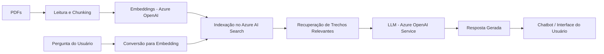

# dio-dp100

## Prevendo Vendas de Sorvete com Machine Learning

### Cenário do Projeto: Gelato Mágico

Imagine que somos proprietários da sorveteria **Gelato Mágico**, localizada em uma cidade litorânea. Diariamente, a quantidade de sorvetes vendidos varia drasticamente, e percebemos uma forte correlação entre as vendas e a temperatura ambiente.

Para otimizar nossa produção e evitar o desperdício ou a perda de vendas, decidimos usar Machine Learning. Nosso objetivo é construir um modelo preditivo capaz de prever as vendas diárias de sorvete com base na temperatura, permitindo um planejamento de produção mais eficiente.

---

### O que foi feito neste projeto

Este projeto prático foi desenvolvido para aplicar os conceitos de **Machine Learning para Regressão Preditiva** utilizando as ferramentas e serviços da **Microsoft Azure**. A seguir, apresento os principais pontos abordados:

* **Análise Inicial dos Dados:** Utilizamos dados fictícios de temperatura e vendas para iniciar a modelagem. No arquivo `inputs/temperatura_vendas.txt`, podemos ver a base de nossas informações para a análise.
* **Treinamento do Modelo no Azure Machine Learning:** Em vez de usar bibliotecas locais, treinamos nosso modelo de regressão diretamente na plataforma **Azure Machine Learning**. Isso nos permite aproveitar o poder computacional da nuvem e gerenciar todo o ciclo de vida do modelo em um único lugar.
* **Gerenciamento de Modelos:** A funcionalidade de **Registro de Modelos do Azure Machine Learning** foi usada para versionar e gerenciar diferentes versões do nosso modelo. Isso garante a rastreabilidade e a reprodutibilidade dos nossos experimentos.
* **Implantação do Modelo como um Web Service:** O modelo treinado foi implantado como um **endpoint HTTP** usando o Azure Machine Learning. Isso nos permite criar uma API que recebe a temperatura como entrada e retorna a previsão de vendas em tempo real, pronta para ser consumida por outros aplicativos.

---

### Insights e Possibilidades de Melhoria

Após a análise inicial, alguns insights e possibilidades de melhoria já se destacam:

1.  **A Regressão é a Ferramenta Ideal:** A natureza do nosso problema, que é prever um valor contínuo (número de sorvetes), se alinha perfeitamente com os problemas de **regressão**. Modelos como Regressão Linear, Árvores de Decisão ou até Redes Neurais seriam ótimas opções, e o Azure ML oferece suporte a todos eles.
2.  **A Importância de Mais Dados:** O modelo inicial foi baseado em poucas sentenças. Para um resultado mais preciso e robusto, seria fundamental coletar mais dados históricos, incluindo outros fatores que podem influenciar as vendas, como feriados, eventos locais ou até mesmo o dia da semana.
3.  **Monitoramento e Automação:** O **Azure Machine Learning** permite automatizar o treinamento e a re-implantação do modelo (CI/CD). Também é possível monitorar o desempenho do modelo em produção e ser alertado sobre possíveis desvios, garantindo que a previsão continue precisa ao longo do tempo.
4.  **Integração com Outros Serviços Azure:** O modelo pode ser facilmente integrado com outros serviços como **Azure Functions** para processar eventos, **Azure Data Lake** para armazenar dados e **Power BI** para visualização e análise de vendas.

Este projeto demonstra como as ferramentas de nuvem da Microsoft podem ser usadas para construir e gerenciar soluções de Machine Learning de ponta a ponta. É uma excelente maneira de construir um portfólio e demonstrar habilidades práticas em MLOps e ciência de dados.

## Criando um Chatbot Baseado em Conteúdo de PDFs

## Cenário do Projeto: O Assistente de TCC

Como estudante de Engenharia de Software, a tarefa de escrever o Trabalho de Conclusão de Curso (TCC) envolve a árdua leitura de dezenas, ou até centenas, de artigos científicos. O maior desafio é extrair informações relevantes e correlacionar ideias de forma eficiente. Diante disso, este projeto propõe a criação de um chatbot inteligente, capaz de ler, compreender e responder a perguntas baseadas no conteúdo de PDFs.

Este sistema atua como um "assistente de pesquisa" interativo, liberando tempo valioso para focar na análise e na escrita do seu projeto. O objetivo final é ter um chatbot capaz de conversar com seus documentos, tornando a revisão bibliográfica mais dinâmica e produtiva.

---

## Objetivos do Projeto

O desenvolvimento deste chatbot foi guiado pelos seguintes objetivos, utilizando a plataforma de ML/IA Foundry da Azure:

* **Carregamento de PDFs:** Implementar uma rotina para carregar um ou múltiplos arquivos PDF, que servirão como a base de conhecimento para o chatbot.
* **Indexação com Busca Vetorial:** Utilizar Azure AI Search para indexar os documentos e transformar o texto dos PDFs em representações numéricas (embeddings). Essa técnica permite que o chatbot localize rapidamente trechos relevantes dos documentos, mesmo que as palavras exatas não sejam as mesmas da pergunta.
* **Geração de Respostas por IA:** Integrar um modelo de linguagem avançado (LLM) como o Azure OpenAI Service para que ele possa gerar respostas contextuais e coerentes, sempre fundamentadas nos trechos recuperados dos PDFs.
* **Interface de Chat Interativa:** Construir uma interface de usuário simples e intuitiva, onde é possível fazer perguntas e receber respostas de forma conversacional, com referências claras ao conteúdo de origem.

---

## Como o Sistema Funciona

O projeto se baseia em uma arquitetura de **Retrieval-Augmented Generation (RAG)**, implementada com os serviços da Azure:

1. **Leitura e Processamento:** Os PDFs são lidos e divididos em pedaços menores (chunks) de texto.  
2. **Vetorização:** Cada pedaço de texto é convertido em um vetor numérico (embedding) usando um modelo do Azure OpenAI Service. Esses vetores são então armazenados e indexados no Azure AI Search.  
3. **Consulta:** Quando o usuário faz uma pergunta, a pergunta também é convertida em um vetor. O Azure AI Search encontra os pedaços de texto dos PDFs que são semanticamente mais próximos (relevantes) à pergunta.  
4. **Geração:** Os trechos de texto relevantes são então passados para um LLM no Azure OpenAI Service junto com a pergunta original. O LLM utiliza essas informações para gerar a resposta final, garantindo que ela seja precisa e baseada nos dados dos PDFs.  

---

## Fluxo Arquitetural (RAG)

---

## Próximos Passos e Oportunidades de Expansão

Este projeto é uma excelente base para explorar conceitos mais avançados. Algumas possibilidades incluem:

* **Otimização:** Explorar diferentes modelos de embeddings ou tamanhos de chunks para melhorar a precisão da busca, utilizando as ferramentas de experimentação do Azure Machine Learning.  
* **Fontes de Dados:** Expandir o sistema para incluir outros formatos de arquivo, como documentos do Word, PowerPoints ou páginas da web, aproveitando os conectores de dados da Azure.  
* **Interface Gráfica:** Aprimorar a interface de chat com funcionalidades adicionais, como histórico de conversas e formatação de texto.  

